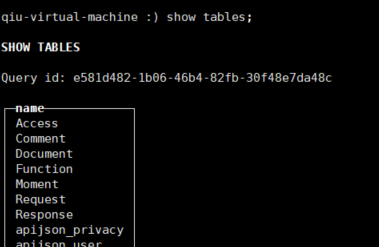
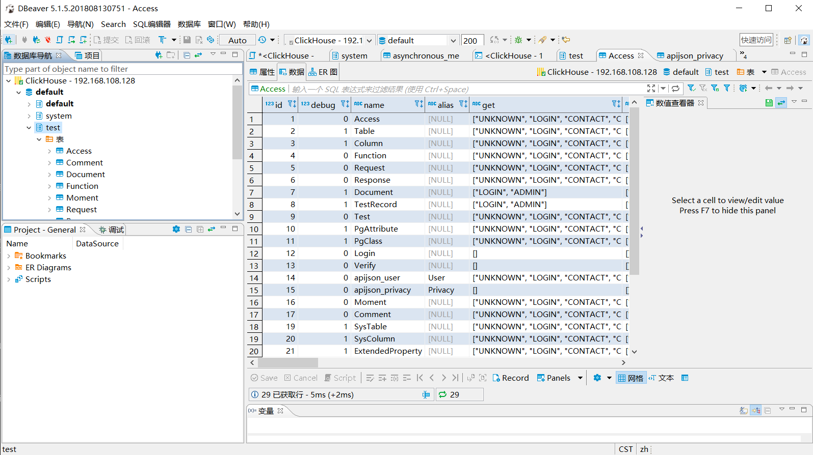

进行测试的Demo项目

📝 内容：SpringBoot+APIJSON 接入 clickhouse数据库

📙 clickhouse官方文档：[点击](https://clickhouse.tech/docs/zh/sql-reference/syntax/)

**已经完成内容：**

👌 在虚拟机中安装了clickhouse，使用xshell连接，并把本地mysql中的测试数据全部迁移到了clickhouse中

👌 使用DBeaver 连接了ClickHouse ，能方便查看数据

👌 根据官方demo编写了clickhouse的demo，在本地运行项目能够在http://apijson.cn/api/  进行基本的查询。

👌  APIPJSON-ORM 查询源码过了一遍 

**待完成内容：**

测试

**遇见的bug：**

1. 解决了click-jdbc jar包版本直接引入与springboot-web包冲突的问题

2. 解决了远程数据库访问权限的问题

3. 解决了linux中 clickhouse数据库表名大小写识别的问题

4. 

   

